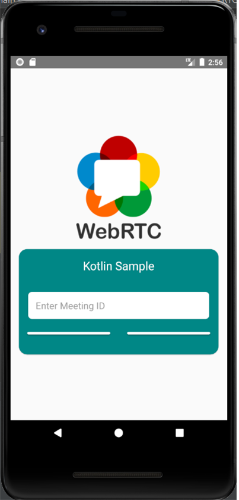
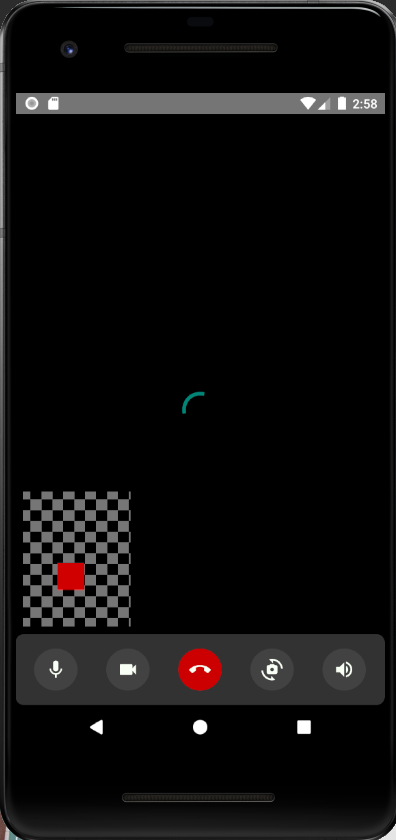

## Use WebRTC(Real-Time Communication) with Kotlin
___
* Real-Time(Just Communication)
* P2P Network
* Login/Signup Layout

* create Key

* real-time comunication

* Login Layout

* Signup Layout

* Home
