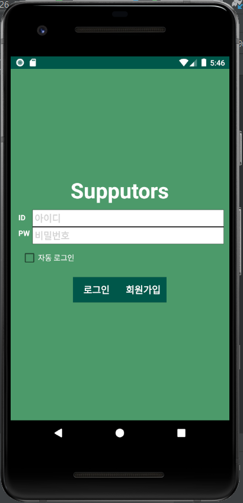
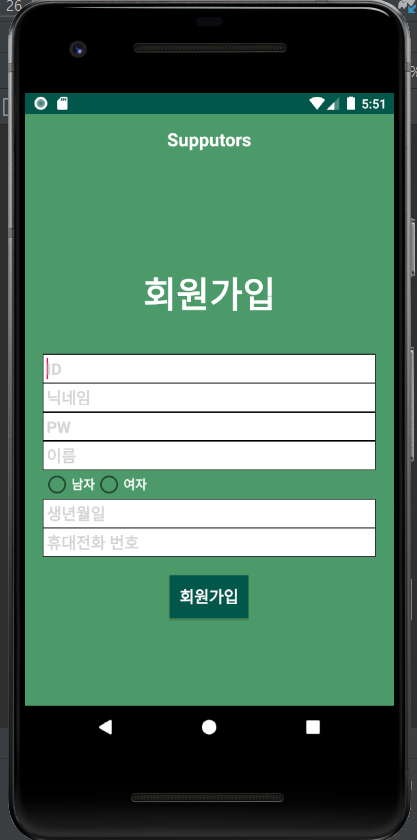
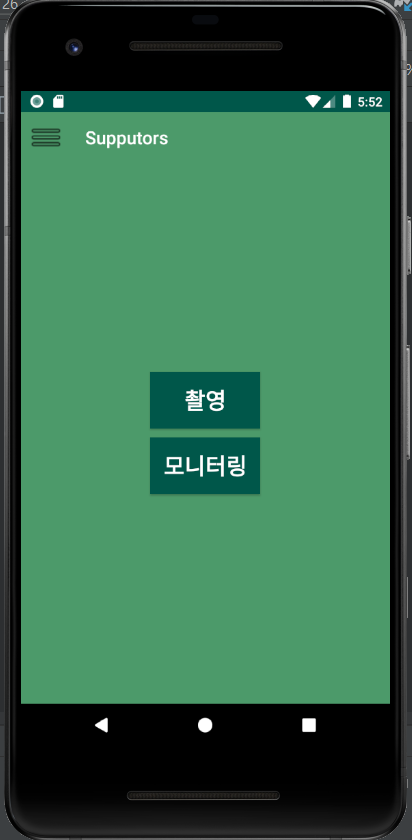

# WebRTC(Real-Time-Communication) and Video Record

---

- Web RTC(Real-Time-Communication) with Kotlin
- P2P Network
- Create Key
- Video Record
- Login / Signup

## 실시간 모니터링

< Create Room Key >

사용자가 입력한 키가 유일한 키이면 방 생성.

키가 다른 사람이 만든 키와 중복될 경우 방 생성 불가.

<image width="50%" src = "https://user-images.githubusercontent.com/55488114/129470516-e02b86aa-f3b4-4501-9ca2-b174423b60e4.gif">

< WebRTC Start & Record Start >

<image width="50%" src = "https://user-images.githubusercontent.com/55488114/129470593-0e454d2f-6fb3-46a1-b400-b94c8f92612b.gif">

< 카메라 전환과 RTC & Record >

<image width="50%" src = "https://user-images.githubusercontent.com/55488114/129470670-a70d71e7-9dec-4bbd-8445-4026ff578390.gif">

## 영상 녹화 결과 영상 (일부)

<image width="40%" src = "https://user-images.githubusercontent.com/55488114/129470715-46981037-f2c6-4cc2-98c2-d0264db0df2d.gif">

## 로그인

## 회원가입

## 메뉴

👩🏻‍💻  이 어플리케이션은 Android 8.1.0(2019.03.29) 버전에 최적화되어있습니다.